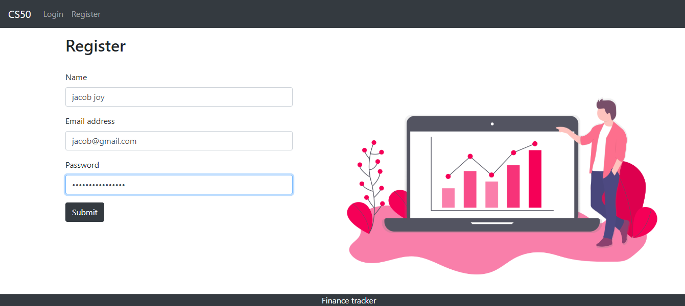
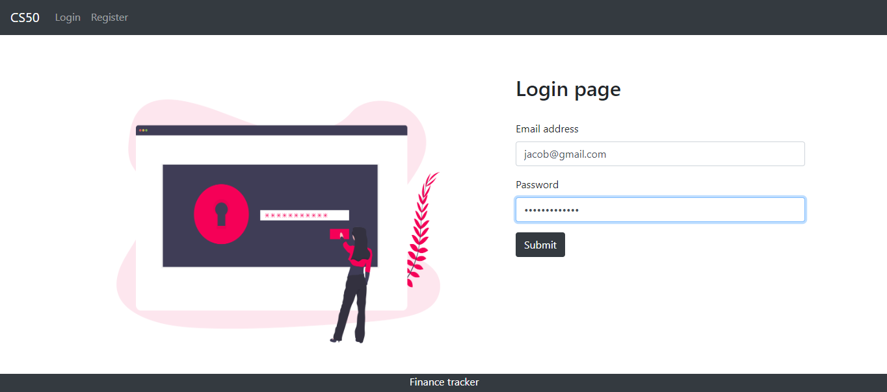
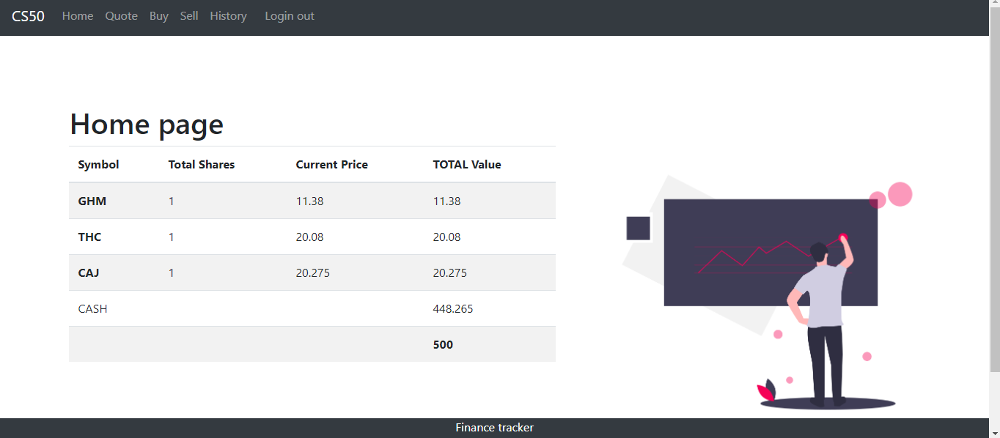
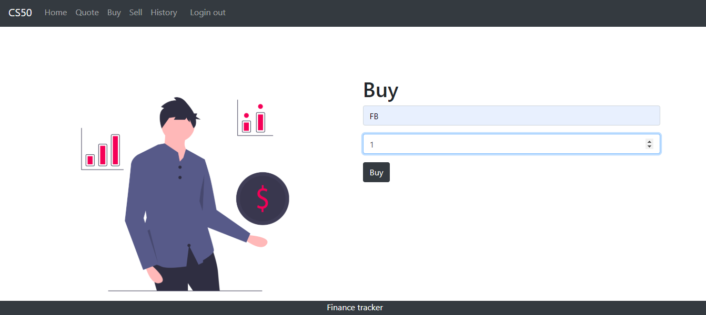
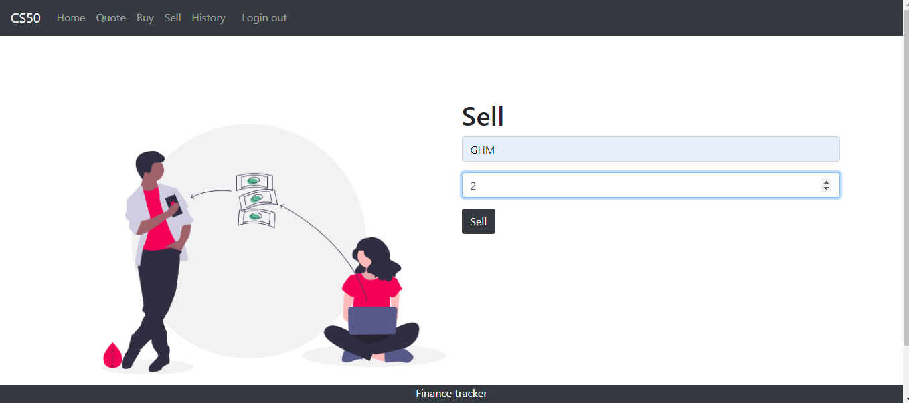
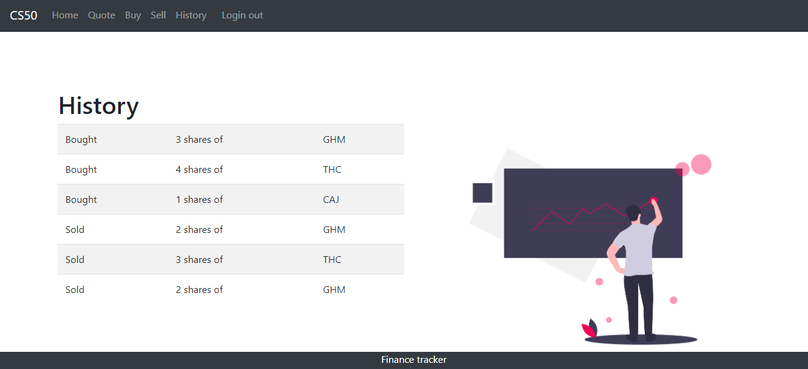

# Finance Tracker

Finance Tracker is a web app implemented using Flask and bootstrap that works like a mini stock exchange system. The following functionalities have been added to the app-

- Register: Any person can register to make a new account.
- Quote: A registered user can quote a price for a stock.
- Buy: Users can buy shares for a price.
- Index: To show the stocks in the user's account.
- Sell: Users can sell shares of a stock.
- History: User can see the past transaction history.

### Project Demo

https://youtu.be/AO-2lRHk4hU

 

 

 

 

 

## Tech Stack-

* Python
* Flask
* SQLAlchemy
(Other dependancies can be found out in te requirements.txt file)

## Installation-

1] Star and clone the repository to your machine.

2] Run the command `pip install -r requirements.txt`

3] Once all the dependancies have been installed, run the command `python Main.py`

4] This should start a local server and you can access it on your browser.
